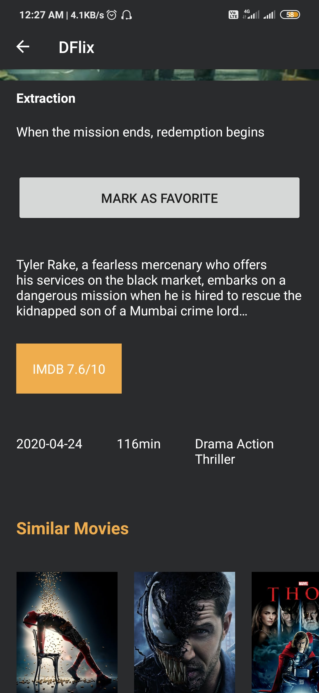

# DFlix

This project uses - 
* MVVM
* FIREBASE
* DAGGER2
* RXJava
* RXAndroid
* ROOM
* RETROFIT2
* JETPACK NAVIGATION
* NETWORK CACHING
* NETWORK CALLS BEST PRACTICES.

This project also uses a session manager, where the session manager is managed in the base activity.
The session manager allows to save the current loggedin state of the user.
If the user is already loggedin, then he/she does not need to log in again,
instead they would be taken to the main screen automatically.

---

# Screenshots

|||
|--|--|--|
